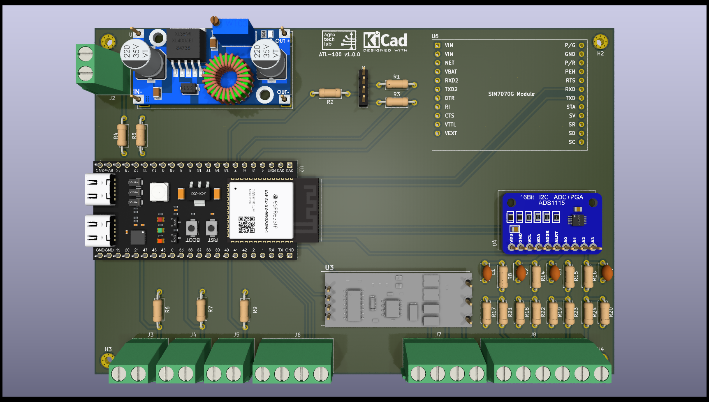

# ATL-100 (Hardware)

**ATL-100** is a multiparametric station developed by <a href="https://agrotechlab.lages.ifsc.edu.br">AgroTechLab (*Technology Development 
Laboratory for Agribusiness*)</a> of <a href="https://www.ifsc.edu.br">IFSC (*Federal Institute of Santa Catarina*)</a>.

It can be used as meteorological station, agrometeorological station, hydrological station, aquaculture station, tide gauge station or fire monitoring station (forest or urban environment).

It is based on ESP32-S3 MCU and has two versions:

 - THT (*Through-Hole Technology*) - aims to be easy to apply and low cost;
 - SMT (*Surface Mount Technology*) - aims to optimize performance and size;

## THT (*Through-Hole Technology*)

ATL-100 THT version aims to be easy to apply and low cost. For this reason it uses COTS (*Commercial Off-The-Shelf*) hardware.

 

## SMT (*Surface Mount Technology*)

Under development yet.
